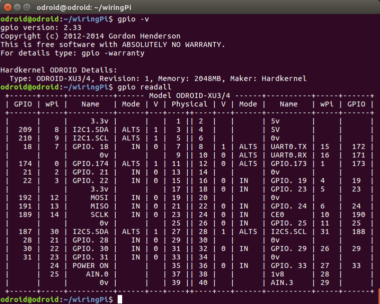

*****************************
Odroid XU4 Setup Instructions
*****************************

Setup
=====

**Prerequisites.** Download the full Ubuntu image (not minimal) for ODroid XU4 from `here <https://odroid.in/ubuntu_16.04lts/>`_. Grab a copy of `Etcher <https://etcher.io/>`_ to flash the image onto a micro-SD card - you've got one ready, right?

*Warning*: as of writing this, Ubuntu 16.04 is not the latest version of Ubuntu available for the ODroid XU4. The reason we're sticking with 16.04 for now is because some of the software we use - especially the less popular one - might not be compatible with the latest version of Ubuntu. For example, the camera control software provided by FLIR relies on libraries that have been deprecated in Ubuntu 18.04 and only available in Ubuntu 16.04.

**Booting Up.** After Etcher is done flashing the image, safely eject the card and plug the micro-SD into the ODroid. Before turning on the power, make sure the boot media slider is set to uSD (not eMMC). Red and blue LEDs will turn on when the ODroid is ready. 

**Connecting to ODroid.** Connect the ODroid to a router with an ethernet cable - your PC must be on the router's network, too, either via a wired or wireless connection. The router must be connected to Internet, otherwise you won't be able to update the ODroid and pull code from repositories.

After you connect the ODroid to the router, check it's IP address either via the homepage of the router, or by scanning the network using `nmap <https://nmap.org/>`_. Let's assume the IP address of the ODroid is ``192.168.0.17``. Connect to the ODroid by typing in your terminal:

.. code-block:: bash

    ssh odroid@192.168.0.17

Confirm you want to continue connecting; when prompted for a password, enter ``odroid``. Remember, you won't see the characters you're entering in the terminal - this is a security feature. If everything goes well, your terminal prompt will change to ``odroid@odroid:~$``.

**Updating.** After you successfully connect to the ODroid, get the latest updates for Ubuntu by typing in the terminal:

.. code-block:: bash

    sudo apt-get update
    sudo apt-get upgrade

Remember, the default ``sudo`` password is ``odroid``. The update may take a few minutes - at this point you can grab a cup of coffee, and by the time you're back the update will have finished. 

After the update is completed, the ODroid is ready to be configured to run your on-board programs.

Collecting Dependencies
=======================

**Git.** Git doesn't come with Ubuntu out-of-the-box, so install it with the following command:

.. code-block:: bash

    sudo apt-get install git

**Python 3.6.5** Out-of-the-box, Ubuntu 16.04 for ODroid comes with Python 3.5.2, which is too old for us - camera control software was developed using Python 3.6.5 - so we need to get the newer version. First, get all the dependencies needed to compile and install Python.

.. code-block:: bash

    sudo apt-get install build-essential checkinstall libreadline-gplv2-dev libncursesw5-dev libssl-dev libsqlite3-dev tk-dev libgdbm-dev libc6-dev libbz2-dev

After these packages have been installed, change your working directory to ``Downloads`` and get Python 3.6.5 source code from ``python.org``.

.. code-block:: bash

    cd ~/Downloads
    wget https://www.python.org/ftp/python/3.6.5/Python-3.6.5.tgz

Next you will need to unpack the archive - remember to do it with ``sudo`` privileges.

.. code-block:: bash

    sudo tar xzf Python-3.6.5.tgz

Finally, move into the unpacked folder and run the following commands to configure and install Python 3.6.5. Note that both the configuration and installation may take a few minutes.

.. code-block:: bash

    cd Python-3.6.5
    ./configure
    sudo make install

You should be able to use Python 3.6.5 immediately after the installation is finished. Type in the terminal ``python3.6 --version`` and you should see ``3.6.5`` in the output.

*Note*: both the default Python2 and Python3 installations don't include ``pip``. However, Python 3.6.5 is bundled with ``pip`` and installing Python also installs ``pip``. Now you can run ``pip`` by typing the following command in the terminal.

.. code-block:: bash

    python3.6 -m pip

**Point Grey/FLIR Spinnaker.** Camera control software built with Spinnaker is currently under constructions. This section will be updated with instructions once it's ready.

**PySimpleBGC.** PySimpleBGC is a Python package providing an API to communicate with `gimbal control board <https://www.basecamelectronics.com/simplebgc32ext/>`_. Install it with `pip <https://pip.pypa.io/en/stable/>`_:

.. code-block:: bash

    sudo pip install pysimplebgc

**WiringPi.** `WiringPi <http://wiringpi.com/>`_ is a driver library for accessing GPIO pins on the ODroid. From the home directory (enter ``cd ~`` in terminal to quickly get there), type in the terminal: 

.. code-block:: bash

    git clone https://github.com/hardkernel/wiringPi.git
    cd wiringPi/
    ./build

After the build script finishes executing, test your installation of WiringPi.

.. code-block:: bash

    gpio -v
    gpio readall

If the installation was successful, you should see something similar in your terminal.

Finally, get a version of WiringPi with a Python wrapper from `Hardkernel's repository <https://github.com/hardkernel/WiringPi2-Python>`_:

.. code-block:: bash

    git clone https://github.com/hardkernel/WiringPi2-Python.git

Finish installing WiringPi2-Python by following the instructions in the README.